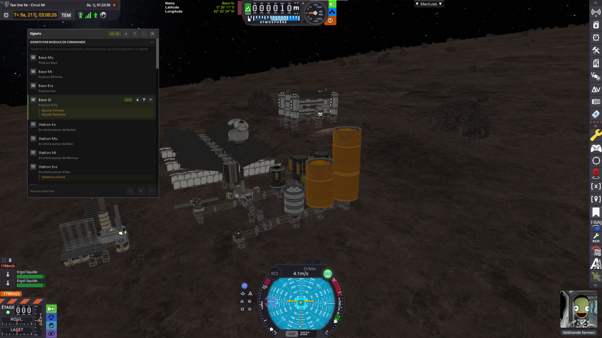

# Vessel Bookmark Mod

A Kerbal Space Program mod that lets you create bookmarks on vessels (by command module or by vessel) so you can find and manage them easily.



**Bookmarks on a command module**: The bookmark is tied to the part, not the vessel. When you dock or undock a vessel, the bookmark does not disappear—you can even find a vessel that is currently docked to a space station.

**Bookmarks on vessels**: They remain essential because some vessels have no command module (debris, discarded stages, etc.). The "Add" button in the main window lets you add a bookmark for the active vessel, whatever it is.

## Features

- **Two bookmark types**: By command module (right-click on a cockpit, probe core, etc.) or by whole vessel ("Add" button in the mod’s main window)
- **Navigation**: "Go to vessel" button to switch directly to that vessel
- **Set as target**: Button to make that vessel the current vessel’s target
- **Comments**: Personal note per bookmark
- **Highlight main vessel**: Bookmarks that points to the current active vessel are highlighted
- **Filters**: By celestial body, by vessel type (ship, station, probe, rover, etc.), and to show only bookmarks that have a comment
- **Search**: Text search in the label, situation, vessel name, type, and comment
- **Custom order**: ↑ / ↓ buttons to reorder bookmarks
- **Invalid bookmark indication**: If the vessel no longer exists (destroyed or merged after docking), the bookmark is shown in grey and italic
- **Persistence**: Bookmarks are saved with your game save
- **Alarm integration**: Icon when an alarm is associated with the vessel
- **Localization**: The mod is available in English and French

## Installation

1. Download the latest version from [releases](https://github.com/lhervier/KSP-VesselBookmark/releases)
2. Extract the `VesselBookmarkMod` folder into `KSP/GameData/`
3. Dependencies to install in `GameData`:
   - [ModuleManager](https://github.com/sarbian/ModuleManager) (required)

## Usage

### Adding a bookmark

- **From a command module**: Right-click the capsule, probe core, etc. → "Add to Bookmarks" in the part menu
- **From the window**: Open the bookmarks window and click "Add" to add the active vessel

### Bookmarks window

- Mod icon in the toolbar (Flight, Map View, Tracking Station, Space Center)
- Filters: body, vessel type, "Comment" checkbox to show only bookmarks with a comment
- Search field to filter by text
- For each bookmark: edit comment, set as target, go to vessel, move up/down, remove

### Navigation

- **Go to vessel**: Switches to that vessel in flight, or loads the flight and focuses the camera from Tracking Station / Map View
- **Set as target**: Sets that vessel as target (same as the game’s "Set as Target")

## Building from source

### Cloning the repository

This project uses the [KSP-Shared](https://github.com/lhervier/KSP-Shared) repository as a git submodule (in the `KSP-Shared` folder). Its source files are compiled directly into `VesselBookmarkMod.dll`, so you must initialize the submodule before building.

- Clone with submodules in one step:
  ```batch
  git clone --recurse-submodules https://github.com/lhervier/KSP-VesselBookmark.git
  ```

- Or, if you already cloned the repository without submodules:
  ```batch
  git submodule update --init --recursive
  ```

- To later update the submodule to the latest `main`:
  ```batch
  git submodule update --remote KSP-Shared
  ```

### Prerequisites

- .NET 4.7.2 or later
- KSP installed (for assembly references)

### Build

1. Set the `KSPDIR` environment variable to your KSP install directory:
   ```batch
   set KSPDIR=C:\Path\To\Kerbal Space Program
   ```

2. Run the build script:
   ```batch
   build.bat
   ```

3. The built mod is in `Release\VesselBookmarkMod.zip`

### Install into KSP (after building)

1. Set `KSPDIR` if needed
2. Run:
   ```batch
   install.bat
   ```

## Technical details

- Command-module bookmarks use the module’s `flightID` as the unique identifier.
- Bookmarks are stored in the save file under the `VESSEL_BOOKMARKS` node.
- A `VesselBookmarkPartModule` is injected by ModuleManager into all parts with `ModuleCommand` for the context menu.

## Compatibility

- **KSP**: 1.x (tested with 1.12+)
- **Dependencies**: ModuleManager

## License

MIT — see the [LICENSE](LICENSE) file.

## Bugs and feature requests

[Open an issue](https://github.com/lhervier/KSP-VesselBookmark/issues) on GitHub.
